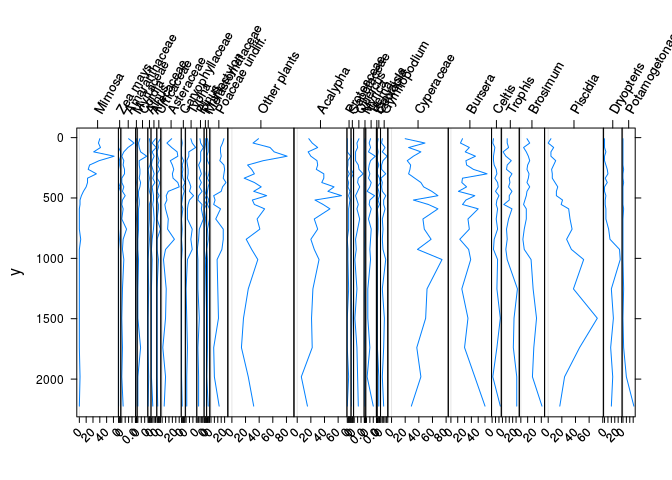
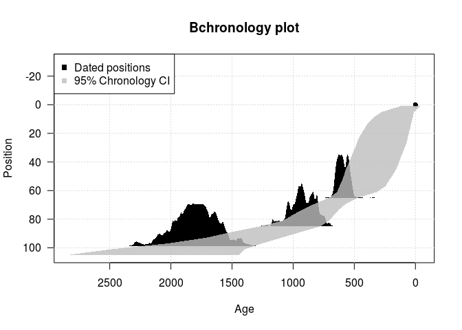

# Age model and chronology construction
Simon Goring  

# Building Chronologies

Time is central to understanding paleoecological change.  For this reason, having reliable and robust chronologies within paleoecological analysis is critical for understanding change.  This workbook will illustrate simple workflows for generating three of the most commonly used age models (clasical, Bacon and BChron), and for understanding their outputs.

## Work Plan

This workbook will show the user how to:

  * Obtain data from the Neotoma Paleoecological Database
  * Work with Neotoma's reported chronologies & understand their strengths & weaknesses
  * Obtain the raw geochronological data for a record
  * Build an age model using the chronological data using the Bayesian method in `BChron`

# Obtaining data from the Neotoma Paleoecological Database

Data from Neotoma can be accessed using the `neotoma` package for R.  To download data from Neotoma we first need to load the library and issue a request for data.  Neotoma can return site information, more complete dataset information and the full download information.  Let's start by looking at datasets with pollen information.

```r
install.packages('neotoma')
```

Now, let's search for data and see what we get:


```r
library(neotoma)
library(analogue)
library(Bchron)

pollen_sites <- get_dataset(datasettype = 'pollen', gpid = 'Mexico')
```

This returns 19 datasets for Switzerland.  You can access the help for `get_dataset()` using the R command `?get_dataset`, and you can then see more information about search terms available.

Given the number of sites, it might be a bit annoting to just print out the whole list of sites using `print(pollen_sites)`, or just by typing `pollen_sites`.  There are two ways of viewing the sites spatially, either `plot(pollen_sites)` or `plot_leaflet(pollen_sites)`.  Let's have a bit of fun by using the `plot_leaflet()` function:


```r
plot_leaflet(pollen_sites)
```

<!--html_preserve--><div id="htmlwidget-0365f869eef5652cc093" style="width:672px;height:480px;" class="leaflet html-widget"></div>
<script type="application/json" data-for="htmlwidget-0365f869eef5652cc093">{"x":{"options":{"crs":{"crsClass":"L.CRS.EPSG3857","code":null,"proj4def":null,"projectedBounds":null,"options":{}}},"calls":[{"method":"addProviderTiles","args":["Stamen.TerrainBackground",null,null,{"errorTileUrl":"","noWrap":false,"zIndex":null,"unloadInvisibleTiles":null,"updateWhenIdle":null,"detectRetina":false,"reuseTiles":false}]},{"method":"addCircleMarkers","args":[[18.666667,19.5,19.583333,29.7708333333333,29.7708333333333,29.7708333333333,29.7708333333333,29.7708333333333,29.7708333333333,29.7708333333333,29.8194444444444,20.866667,20.866667,21.5661,20.3882,20.43105,18.376145,21.5794444444444,31.32215],[-95,-99,-101.583333,-112.576388888889,-112.576388888889,-112.576388888889,-112.576388888889,-112.576388888889,-112.576388888889,-112.576388888889,-112.633333333333,-90.133333,-90.133333,-88.0865,-101.256,-101.249,-94.95557,-88.0721388888889,-109.25616],10,null,null,{"clickable":true,"draggable":false,"keyboard":true,"title":"","alt":"","zIndexOffset":0,"opacity":1,"riseOnHover":true,"riseOffset":250,"stroke":true,"color":"#03F","weight":5,"opacity.1":0.5,"fill":true,"fillColor":"#03F","fillOpacity":0.2,"dashArray":null},{"showCoverageOnHover":true,"zoomToBoundsOnClick":true,"spiderfyOnMaxZoom":true,"removeOutsideVisibleBounds":true,"spiderLegPolylineOptions":{"weight":1.5,"color":"#222","opacity":0.5},"freezeAtZoom":false},null,["<b>Lago Catemaco<\/b><br><b>Description:<\/b> Volcanic lake. Physiography: Sierra de los Tuxtlas. Surrounding vegetation: agricultural, remnant forest.<br><a href=http://apps.neotomadb.org/explorer/?siteids=340>Explorer Link<\/a>","<b>Chalco Lake<\/b><br><b>Description:<\/b> Playa, marsh, shallow lake. Physiography: basin surrounded by stratovolcanoes. Surrounding vegetation: cultives.<br><a href=http://apps.neotomadb.org/explorer/?siteids=349>Explorer Link<\/a>","<b>Lake Patzcuaro<\/b><br><b>Description:<\/b> Lake dammed by basalt flow. Physiography: volcanic mountains. Surrounding vegetation: secondary pine-oak woodland.<br><a href=http://apps.neotomadb.org/explorer/?siteids=1804>Explorer Link<\/a>","<b>Sierra Bacha 1<\/b><br><b>Description:<\/b> East-facing rockshelter in rhyolite. Located about 1.5 km inland from the Gulf of California in Coloradito Canyon. Surrounding vegetation: creosote, elephant tree, brittlebush.<br><a href=http://apps.neotomadb.org/explorer/?siteids=2265>Explorer Link<\/a>","<b>Sierra Bacha 1<\/b><br><b>Description:<\/b> East-facing rockshelter in rhyolite. Located about 1.5 km inland from the Gulf of California in Coloradito Canyon. Surrounding vegetation: creosote, elephant tree, brittlebush.<br><a href=http://apps.neotomadb.org/explorer/?siteids=2265>Explorer Link<\/a>","<b>Sierra Bacha 1<\/b><br><b>Description:<\/b> East-facing rockshelter in rhyolite. Located about 1.5 km inland from the Gulf of California in Coloradito Canyon. Surrounding vegetation: creosote, elephant tree, brittlebush.<br><a href=http://apps.neotomadb.org/explorer/?siteids=2265>Explorer Link<\/a>","<b>Sierra Bacha 1<\/b><br><b>Description:<\/b> East-facing rockshelter in rhyolite. Located about 1.5 km inland from the Gulf of California in Coloradito Canyon. Surrounding vegetation: creosote, elephant tree, brittlebush.<br><a href=http://apps.neotomadb.org/explorer/?siteids=2265>Explorer Link<\/a>","<b>Sierra Bacha 1<\/b><br><b>Description:<\/b> East-facing rockshelter in rhyolite. Located about 1.5 km inland from the Gulf of California in Coloradito Canyon. Surrounding vegetation: creosote, elephant tree, brittlebush.<br><a href=http://apps.neotomadb.org/explorer/?siteids=2265>Explorer Link<\/a>","<b>Sierra Bacha 1<\/b><br><b>Description:<\/b> East-facing rockshelter in rhyolite. Located about 1.5 km inland from the Gulf of California in Coloradito Canyon. Surrounding vegetation: creosote, elephant tree, brittlebush.<br><a href=http://apps.neotomadb.org/explorer/?siteids=2265>Explorer Link<\/a>","<b>Sierra Bacha 1<\/b><br><b>Description:<\/b> East-facing rockshelter in rhyolite. Located about 1.5 km inland from the Gulf of California in Coloradito Canyon. Surrounding vegetation: creosote, elephant tree, brittlebush.<br><a href=http://apps.neotomadb.org/explorer/?siteids=2265>Explorer Link<\/a>","<b>Sierra Bacha 3<\/b><br><b>Description:<\/b> Located in Escondido Canyon. Surrounding vegetation: creosote, elephant tree, brittlebush.<br><a href=http://apps.neotomadb.org/explorer/?siteids=2266>Explorer Link<\/a>","<b>San Jose Chulchaca<\/b><br><b>Description:<\/b> Small cenote. Physiography: karst plain. Surrounding vegetation: secondary thorn scrub.<br><a href=http://apps.neotomadb.org/explorer/?siteids=2311>Explorer Link<\/a>","<b>Cenote San Jose Chulchaca<\/b><br><b>Description:<\/b> Small Cenote. Physiography: karst plain. Surrounding vegetation: secondary thorn scrub.<br><a href=http://apps.neotomadb.org/explorer/?siteids=2312>Explorer Link<\/a>","<b>Ría Lagartos<\/b><br><b>Description:<\/b> Coastal lagoon. Local vegetation: Metopium brownei, Bursera simaruba, Haematoxylum campechianum, Conocarpus erectus, Plumeria sp., and Bravaisia sp. Physiography: coastal plain. Located 5.4 km from the Gulf of Mexico.<br><a href=http://apps.neotomadb.org/explorer/?siteids=7548>Explorer Link<\/a>","<b>Hoya San Nicolás<\/b><br><b>Description:<\/b> Dessicated maar lake in the Valle de Santiago. Most of the area is now agricultural, while the uncultivated areas have been effected by grazing, logging, and other forms of human-induced disturbance. Presettlement vegetation was tropical deciduous woodland.<br><a href=http://apps.neotomadb.org/explorer/?siteids=8562>Explorer Link<\/a>","<b>Hoya Rincon de Parangueo<\/b><br><b>Description:<\/b> Maar lake in the Valle de Santiago. Lake was almost dry when cored in 2001, but was 50 m deep in 1979. Most of the area is now agricultural, while the uncultivated areas have been effected by grazing, logging, and other forms of human-induced disturbance. The crater does, however, contain a floristically rich remnant of subtropical forest.<br><a href=http://apps.neotomadb.org/explorer/?siteids=8563>Explorer Link<\/a>","<b>Laguna Pompal<\/b><br><b>Description:<\/b> Small spring-fed lake on the western flank of Volcan Santa Marta. Surrounding vegetation: Bombax ellipticum, Brosimum alicastrum, Bursera simaruba, Cordia alliodora, Ficus spp, and Ilex condensata.<br><a href=http://apps.neotomadb.org/explorer/?siteids=10105>Explorer Link<\/a>","<b>Ría Lagartos-2<\/b><br><b>Description:<\/b> The sampling site is a pond located 3.6 km from the coast. Vegetation around the site is low-stature flooded tropical forest (mangrove swamp) with Conocarpus erecta, Haematoxylum campechianum, Plumeria sp., Thrinax radiata, and Cyperacae. Aquatic vegetation consists of Cladium jamaicense, Poaceae, and Typha.<br><a href=http://apps.neotomadb.org/explorer/?siteids=14149>Explorer Link<\/a>","<b>Cienega de San Bernadino<\/b><br><b>Description:<\/b> Cienega located on the floor of the San Bernadino Valley. Surrounding vegetation: Desert grassland and scrub (Atriplex canascens, Ephedra trifurca, Fouquieria splendens, Larrea tridentata, Flourensia cernua, Acacia neovernicosa). Bottomlands consist of a patchwork of Prosopis and fallow fields. Springs, wells, and seasonal streams in the cienega support areas of deciduous riparian scrub, stands of Populus fremontii,<br><a href=http://apps.neotomadb.org/explorer/?siteids=14163>Explorer Link<\/a>"],null,null,null,null]}],"limits":{"lat":[18.376145,31.32215],"lng":[-112.633333333333,-88.0721388888889]}},"evals":[],"jsHooks":[]}</script><!--/html_preserve-->

Given these datasets, we might as well choose one to download.  In this case, we will be using the Cenote San Jose Chulchaca record.  This pollen record is dataset `2396`, part of the Latin American Pollen Database, and we can see more information about the dataset by using the `browse()` function in the `neotoma` package:

```r
browse(2396)
```

The record seems well constructed, but we will use it to illustrate reconstruction using `BChron`.  First, we will download the dataset:


```r
cen_pol <- get_download(2396)
```

```
## API call was successful. Returned record for Cenote San JoseChulchaca
```

```
## Warning in split_indices(.group, .n): '.Random.seed' is not an integer
## vector but of type 'NULL', so ignored
```

```r
Stratiplot(cen_pol, sort = 'wa', group="TRSH")
```

<!-- -->

# Building the Age Model

The age model is stored within a `download` object's `sample.meta` element.  There is a helper function in the `neotoma` package, `ages()`:

```r
ages(cen_pol[[1]])
```

      depth  thickness   age.older    age  age.younger   chronology.name   age.type                chronology.id   sample.id   dataset.id  unit.name 
---  ------  ----------  ----------  ----  ------------  ----------------  ---------------------  --------------  ----------  -----------  ----------
2         1  NA          NA             9  NA            Leyden 1995b      Radiocarbon years BP             1179       48974         2396  NA        
28        5  NA          NA            45  NA            Leyden 1995b      Radiocarbon years BP             1179       48975         2396  NA        
3         9  NA          NA            82  NA            Leyden 1995b      Radiocarbon years BP             1179       48976         2396  NA        
4        13  NA          NA           118  NA            Leyden 1995b      Radiocarbon years BP             1179       48977         2396  NA        
5        17  NA          NA           154  NA            Leyden 1995b      Radiocarbon years BP             1179       48978         2396  NA        
6        21  NA          NA           191  NA            Leyden 1995b      Radiocarbon years BP             1179       48979         2396  NA        

These ages are the result of the construction of a chronology.  In the case of the Cenote San Jose Chulchaca record we can use the command `length(cen_pol[[1]]$chronologies)` to see that there are three chronologies.  The function `get_chroncontrol()` provides us with the chronological controls used to generate the age model:


```r
cen_chron <- get_chroncontrol(cen_pol)
```

```
## $`2396`
## Chronology for Cenote San Jose Chulchaca, dataset ID: 2396
## Leyden 1995b: Default model, constructed using linear interpolation.
## Model age span: 0 to 2230
## Model age units: Radiocarbon years BP
## 
##   depth thickness  age age.young age.old control.type chron.control.id
## 1     0        NA    0         0       0     Core top             6665
## 2    65         6  590       520     660  Radiocarbon             6666
## 3    85         6 1010       920    1200  Radiocarbon             6667
## 4    99         6 1860      1710    2010  Radiocarbon             6668
## 
## Accessed 2018-01-09 22:00h. 
## 
## attr(,"class")
## [1] "chroncontrol_list" "list"
```

With this record we can pull the depths from `lob_pol[[1]]$sample.meta$depth` to predict the model at, and use the chronology controls as the tie points for the chronology.


```r
cen_chron[[1]]$chron.control$thickness[1] <- 5
cen_chron[[1]]$chron.control$age.young[1] <- cen_chron[[1]]$chron.control$age.young[1] - 1


cen_model <- Bchronology(  ages = cen_chron[[1]]$chron.control$age,
                         ageSds = cen_chron[[1]]$chron.control$age - cen_chron[[1]]$chron.control$age.young,
                      positions = cen_chron[[1]]$chron.control$depth,
            positionThicknesses = cen_chron[[1]]$chron.control$thickness,
               predictPositions = cen_pol[[1]]$sample.meta$depth,
                      calCurves = c("normal", rep("intcal13", 3)))
```

When the model is run it gives us the relatively complex `BchronologyRun` object.  The object itself is described in the help for `Bchronology`.  We can look at the posterior estimates for the model using the `lob_model$thetaPredict` element of the `lob_model` variable.  Here we can see that the posteriors are arranged so that each depth is in a single column, with approximately (or exactly) 1000 rows, representing draws from the predicted distributions.

Given these results, we can use the `plot` function for the chronology:


```r
plot(cen_model)
```

<!-- -->

To then look at the model, and make assessments.  You now have a new age model for your record!
