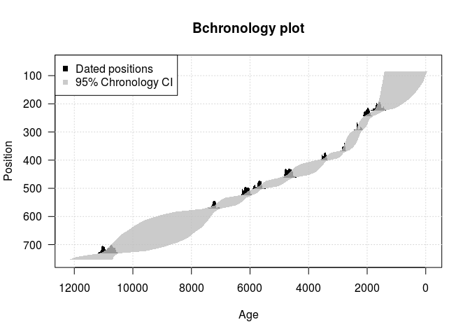

# Age model and chronology construction
Simon Goring  

# Building Chronologies

Time is central to understanding paleoecological change.  For this reason, having reliable and robust chronologies within paleoecological analysis is critical for understanding change.  This workbook will illustrate simple workflows for generating three of the most commonly used age models (clasical, Bacon and BChron), and for understanding their outputs.

## Work Plan

This workbook will show the user how to:

  * Obtain data from the Neotoma Paleoecological Database
  * Work with Neotoma's reported chronologies & understand their strengths & weaknesses
  * Obtain the raw geochronological data for a record
  * Build an age model using the chronological data using the Bayesian method in `BChron`

# Obtaining data from the Neotoma Paleoecological Database

Data from Neotoma can be accessed using the `neotoma` package for R.  To download data from Neotoma we first need to load the library and issue a request for data.  Neotoma can return site information, more complete dataset information and the full download information.  Let's start by looking at datasets with pollen information.

```r
install.packages('neotoma')
```

Now, let's search for data and see what we get:


```r
library(neotoma)
library(analogue)
library(Bchron)

pollen_sites <- get_dataset(datasettype = 'pollen', gpid = 'Switzerland')

pollen_sites
```

```
## A dataset_list containing 18 objects:
## Accessed from 2017-06-14 00:27h to 2017-06-14 00:27h. 
## Datasets:
##  dataset.id           site.name     long      lat   type
##        3863 Aegelsee            7.543333 46.64583 pollen
##        3873 Amsoldingersee      7.575000 46.72500 pollen
##        3874 Amsoldingersee      7.575000 46.72500 pollen
##        3875 Amsoldingersee      7.575000 46.72500 pollen
##        3946 Boehnigsee Goldmoos 7.843056 46.25917 pollen
##        3957 Burgmoos            7.674444 47.17222 pollen
##        3958 Burgmoos            7.674444 47.17222 pollen
##        3959 Burgmoos            7.674444 47.17222 pollen
##        3960 Burgmoos            7.674444 47.17222 pollen
##        3961 Burgmoos            7.674444 47.17222 pollen
##        3962 Burgmoos            7.674444 47.17222 pollen
##        3963 Burgmoos            7.674444 47.17222 pollen
##        3964 Burgmoos            7.674444 47.17222 pollen
##        3965 Burgmoos            7.674444 47.17222 pollen
##        4213 Lobsigensee         7.299167 47.03194 pollen
##        4382 Rotsee              8.325556 47.07556 pollen
##        4383 Rotsee              8.325556 47.07556 pollen
##       20027 Älbi Flue           7.976389 46.59861 pollen
```

This returns 18 datasets for Switzerland.  You can access the help for `get_dataset()` using the R command `?get_dataset`, and you can then see more information about search terms available.

Given these datasets, we might as well choose one to download.  In this case, we will be using the Lobisigensee record.  This pollen record is dataset `4213`, part of the European Pollen Database, and we can see more information about the dataset by using the `browse()` function in the `neotoma` package:

```r
browse(4213)
```

The record seems well constructed, but we will use it to illustrate reconstruction using `BChron`.  First, we will download the dataset:


```r
lob_pol <- get_download(pollen_sites$`4213`)
```

```
## API call was successful. Returned record for Lobsigensee
```

```r
Stratiplot(lob_pol, sort = 'wa', group="TRSH")
```

<!-- -->

# Building the Age Model

The age model is stored within a `download` object's `sample.meta` element.  There is a helper function in the `neotoma` package, `ages()`:

```r
ages(lob_pol[[1]])
```

       depth   thickness  age.older     age  age.younger   chronology.name   age.type                chronology.id   sample.id   dataset.id  unit.name 
----  ------  ----------  ----------  -----  ------------  ----------------  ---------------------  --------------  ----------  -----------  ----------
2         85           1  NA            643  NA            EPD               Radiocarbon years BP             1758       83050         4213  NA        
210       95           1  NA            718  NA            EPD               Radiocarbon years BP             1758       83052         4213  NA        
3        105           1  NA            794  NA            EPD               Radiocarbon years BP             1758       83054         4213  NA        
4        115           1  NA            870  NA            EPD               Radiocarbon years BP             1758       83056         4213  NA        
5        125           1  NA            945  NA            EPD               Radiocarbon years BP             1758       83058         4213  NA        
6        135           1  NA           1021  NA            EPD               Radiocarbon years BP             1758       83060         4213  NA        

These ages are the result of the construction of a chronology.  In the case of the Lobisigensee record we can use the command `length(lob_pol[[1]]$chronologies)` to see that there is only one single chronology.  The function `get_chroncontrol()` provides us with the chronological controls used to generate the age model:


```r
lob_chron <- get_chroncontrol(lob_pol)
```

```
## $`4213`
## Chronology for Lobsigensee, dataset ID: 4213
## EPD: Default model, constructed using Linear interpolation.
## Model age span: 640 to 9950
## Model age units: Radiocarbon years BP
## 
##    depth thickness  age age.young age.old control.type chron.control.id
## 1  223.5         3 1690      1610    1770  Radiocarbon             9816
## 2  244.5         3 2030      1970    2090  Radiocarbon             9817
## 3  293.5         3 2300      2250    2350  Radiocarbon             9818
## 4  368.0         4 2680      2630    2730  Radiocarbon             9819
## 5  401.5         3 3230      3180    3280  Radiocarbon             9820
## 6  461.5         3 4140      4080    4200  Radiocarbon             9821
## 7  501.5         3 4950      4880    5020  Radiocarbon             9822
## 8  524.5         3 5350      5290    5410  Radiocarbon             9823
## 9  572.0         4 6300      6240    6360  Radiocarbon             9824
## 10 731.0         2 9500      9410    9590  Radiocarbon             9825
## 
## Accessed 2017-06-14 00:27h. 
## 
## attr(,"class")
## [1] "chroncontrol_list" "list"
```

With this record we can pull the depths from `lob_pol[[1]]$sample.meta$depth` to predict the model at, and use the chronology controls as the tie points for the chronology.


```r
lob_model <- Bchronology(  ages = lob_chron[[1]]$chron.control$age,
                         ageSds = lob_chron[[1]]$chron.control$age - lob_chron[[1]]$chron.control$age.young,
                      positions = lob_chron[[1]]$chron.control$depth,
            positionThicknesses = lob_chron[[1]]$chron.control$thickness,
               predictPositions = lob_pol[[1]]$sample.meta$depth)
```

When the model is run it gives us the relatively complex `BchronologyRun` object.  The object itself is described in the help for `Bchronology`.  We can look at the posterior estimates for the model using the `lob_model$thetaPredict` element of the `lob_model` variable.  Here we can see that the posteriors are arranged so that each depth is in a single column, with approximately (or exactly) 1000 rows, representing draws from the predicted distributions.

Given these results, we can use the `plot` function for the chronology:


```r
plot(lob_model)
```

<!-- -->

To then look at the model, and make assessments.  You now have a new age model for your record!
