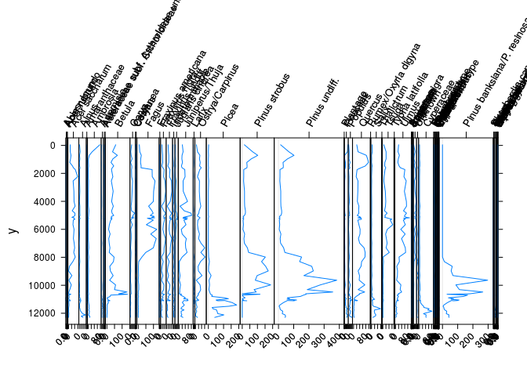

# Pollen-based Climate Reconstruction
Simon Goring  


# Introduction

Pollen-based climate reconstruction is a widely used technique for understanding past climate.  Pollen-based modelling is often highly technical, and requirs a solid understanding of paleoecological processes, ecological knowledge of forest commnuity and species affinities along climate gradients, technical understanding of chronology construction and model fitting.  At the same time, the people who undertake this activity are often graduate students, working in programs that do not include specific units on paleoecology (in some cases) or pollen-based climate reconstruction (in most cases).

In this vignette we will use open-source tools from the [Comprehensive R Archive Network](https://cran.r-project.org/) to reconstruct a single climate record from a site in Canada.  To do this we will first test the calibration dataset against climate data, both from the North American Modern Pollen Database, we will then pick one target climate variable for reconstruction and perform reconstructions using three models, Weighted Averaging with monotone smooth deshrinking, Weighted Averaging Partial Least Squares and the Modern Analogue Technique.

To first evaluate the models we need to see how well the work with the underlying climate data:

# Model Diagnostics


The Modern Pollen Database stored in `analogue` contains 4833 samples, representing 134 different pollen taxa.  The data was obtained from the Whitmore et al (2008) North American Modern Pollen Database.  The raw data can be obtained from one of two sources [the Laboratory for Paleoclimatology and Climatology](http://www.lpc.uottawa.ca/data/modern/) at the University of Ottawa and [the Williams Paleoecology Lab](http://www.geography.wisc.edu/faculty/williams/lab/Downloads.html) at the University of Wisconsin. Modern pollen data is available from the [Neotoma Paleoecology Database](http://neotomadb.org), although the complete North American Modern Pollen Database has not yet been uploaded to Neotoma.

## Checking the Transfer Functions

Considerable work has been put into understanding transfer functions and challenges associated with their construction, implementation and interpretation.  I suggest taking some time to understand the basic theory, starting with the excellent review by Birks et al. in the Journal of Open Ecology [link].  Telford and Birks [ref needed] and others have pointed to the need for more rigorous validation of models, and this vignette is a first step at addressing some of the issues.  As this vignette is developed further I will add more robust cross-validation.

### Checking the calibration data set

To test the models I used the `palaeoSig` package's `randomTS()` function, which tests the models against randomly sorted data.  Significance for any climate variable indicates that the model reconstruction is better than random numbers.  In each case I use 70% of the training set, rather than the full training set.  The model takes the proportion of variance accounted for by the actual data, and then compares it to the proportion of variance accounted for by the randomized data.  This is then done for each of the different methods used for calibration.

In each case these methods are simply testing whether the modern calibration is able to detect signals in each of the climate parameters.  The example here uses the entire North American Modern Pollen Database, rather than a targeted data subset.  It also uses the climate variables provided with the dataset.  For a given research application it may be better to specifically choose a particular climate variable (or climate subset) or obtain new climatic data from a more recent downscaled climate data product, for example WorldClim or PRISM.

#### WA - Monotone Deshrinking


        % Explained   p-value
-----  ------------  --------
tjan           0.17      0.01
tfeb           0.17      0.01
tmar           0.16      0.01
tapr           0.15      0.02
tmay           0.14      0.03
tjun           0.14      0.04
tjul           0.14      0.03
taug           0.15      0.02
tsep           0.15      0.02
toct           0.16      0.02
tnov           0.16      0.02
tdec           0.17      0.01
pjan           0.03      0.76
pfeb           0.03      0.76
pmar           0.04      0.62
papr           0.05      0.51
pmay           0.06      0.32
pjun           0.06      0.41
pjul           0.08      0.17
paug           0.09      0.11
psep           0.07      0.19
poct           0.04      0.60
pnov           0.03      0.84
pdec           0.03      0.84
tave           0.16      0.01
tmax           0.15      0.03
tmin           0.15      0.02
gdd0           0.15      0.02
gdd5           0.14      0.03
mtco           0.17      0.01
mtwa           0.14      0.03
annp           0.04      0.70

Weighted Averaging results using monotone deshrinking on subsets of the pollen data indicate that there is significance in reconstructions of most temperature parameters, while precipitation variables are not significant.  While temperature variables are significant, this relatively naive approach indicates that there is a relatively low proportion of variance explained by the temperature reconstructions, and that the vegetation (or at least the pollen representation of the regional vegetation) is most strongly affected by summer temperatures.

#### WAPLS (Four components)


        % Explained   p-value
-----  ------------  --------
tjan           0.13      0.01
tfeb           0.14      0.01
tmar           0.13      0.01
tapr           0.12      0.01
tmay           0.10      0.01
tjun           0.10      0.01
tjul           0.11      0.01
taug           0.11      0.01
tsep           0.11      0.01
toct           0.12      0.01
tnov           0.12      0.01
tdec           0.13      0.01
pjan           0.03      0.04
pfeb           0.02      0.05
pmar           0.03      0.02
papr           0.04      0.02
pmay           0.04      0.01
pjun           0.03      0.03
pjul           0.06      0.01
paug           0.06      0.01
psep           0.04      0.01
poct           0.02      0.05
pnov           0.02      0.09
pdec           0.02      0.09
tave           0.12      0.01
tmax           0.10      0.01
tmin           0.10      0.01
gdd0           0.11      0.01
gdd5           0.10      0.01
mtco           0.13      0.01
mtwa           0.11      0.01
annp           0.02      0.05

For WAPLS we see the same pattern as with WA.  Temperature variables all show significance, they explain low variance and winter temperatures show higher variance explained than summer variables.

#### MAT - ten closest


        % Explained   p-value
-----  ------------  --------
tjan           0.11      0.01
tfeb           0.12      0.01
tmar           0.11      0.01
tapr           0.10      0.01
tmay           0.09      0.01
tjun           0.08      0.01
tjul           0.09      0.01
taug           0.10      0.01
tsep           0.10      0.01
toct           0.10      0.01
tnov           0.10      0.01
tdec           0.11      0.01
pjan           0.02      0.01
pfeb           0.02      0.01
pmar           0.02      0.01
papr           0.02      0.01
pmay           0.03      0.01
pjun           0.02      0.01
pjul           0.03      0.01
paug           0.04      0.01
psep           0.03      0.01
poct           0.01      0.01
pnov           0.01      0.01
pdec           0.01      0.01
tave           0.11      0.01
tmax           0.09      0.01
tmin           0.08      0.01
gdd0           0.09      0.01
gdd5           0.08      0.01
mtco           0.11      0.01
mtwa           0.09      0.01
annp           0.02      0.01

Reconstructions for MAT show even lower variance explained (although a similar pattern) than the other methods.  This is surprising, in part because MAT often shows better fit as a result of spatial autocorrelation. The very weak variance explained for some variables (`pdec` for example) paired with high significance (p < 0.01), also indicates the risks of choosing variables soley based on `p` value.  It should also be noted that the pattern of variance explained here, and elsewhere represents the impact of temporal autocorrelation on temperature (and, less so) on precipitation variables.

# Reconstruction Statistics

## Reconstruction Significance

Now we test to see which of the fossil assemblage reconstructions show significant changes over the course of the reconstruction.  This uses the same `randomTF()` function, but the degree of variance and significance is likely to change given that the test dataset, in this case Orhid, has changed and has a much more constrained ecological space than the entire European Modern Pollen Database.

### Obtaining a record from Neotoma

Then we apply a reconstruction to a real dataset.  In this case we will select a record with coverage across multiple timescales.  For the sake of this example, we'll restrict the analysis to a record from Canada.


```r
can_sites <- neotoma::get_dataset(ageold = 12000, 
                                  ageyoung = -50, 
                                  gpid = 'Canada',
                                  datasettype = 'pollen')


datasets <- can_sites %>% map_int(function(x) x$dataset.meta$dataset.id)
```
This returns 428 sites.  The `neotoma` package provides plotting capabilities, but they are rudimentary.  To provide interactive plotting we plot the sites dynamically using `leaflet`.  This isn't something you need to do, but it does help showcase the flexibility of R:

<!--html_preserve--><div id="htmlwidget-fe07ca327b0b38d11478" style="width:400px;height:400px;" class="leaflet html-widget"></div>
<script type="application/json" data-for="htmlwidget-fe07ca327b0b38d11478">{"x":{"options":{"crs":{"crsClass":"L.CRS.EPSG3857","code":null,"proj4def":null,"projectedBounds":null,"options":{}}},"calls":[{"method":"addTiles","args":["//{s}.tile.openstreetmap.org/{z}/{x}/{y}.png",null,null,{"minZoom":0,"maxZoom":18,"maxNativeZoom":null,"tileSize":256,"subdomains":"abc","errorTileUrl":"","tms":false,"continuousWorld":false,"noWrap":false,"zoomOffset":0,"zoomReverse":false,"opacity":1,"zIndex":null,"unloadInvisibleTiles":null,"updateWhenIdle":null,"detectRetina":false,"reuseTiles":false,"attribution":"&copy; <a href=\"http://openstreetmap.org\">OpenStreetMap<\/a> contributors, <a href=\"http://creativecommons.org/licenses/by-sa/2.0/\">CC-BY-SA<\/a>"}]},{"method":"addMarkers","args":[[47,53.333333,52.516667,54.583333,64.65,47.481667,45.543056,45.38,78.491667,44.3,47.23,46.4,65.216667,47.18,65.016667,54.047222,57.116667,71.75,72.366667,73.533333,48.936111,55.575,55.333333,47.457778,55.25,54.355833,43.22,46.279167,45.961111,61.683333,47.639722,48.197778,55.666667,46.613889,45.651389,54.799444,53.090833,59.516667,50.873611,53.9,49.69,50.034167,67.833333,48.966944,45.960833,44.1,49.183333,43.5,43.5,43.6,52.116667,51.65,48.4075,55.266667,54.883333,43.233333,54.418889,54.423611,62.05,75.35,60.9875,48.910833,46.45,45.85,53.233333,57.766667,46.408333,44.37,50.69095,61.244444,61.166667,41.92,48.351944,47.609722,52.783333,58.866944,45.282778,45.41,56.25,73.034722,54.742222,60.356667,49.583333,43.82,48.21,46.275833,44.74,45.17,45.995833,45.945833,46.066667,49.448,45.183333,53,64.716667,52.25,55.033333,49.67,43.64,50.768889,50.320556,60.033333,43.236667,68.383333,48.2375,52.933333,47.322222,58.2,45.988889,56.633333,44.516667,64.633333,43.64,43.64,43.65,48.618611,66.135,50.916667,44.483333,47.316667,50.22,46.932778,43.95,48.24,47.257778,45.991944,54.027778,64.166667,47.590278,48.365833,49.816667,44.195833,46.716667,54.8,47.2875,44.263889,53.2375,53.8,55.009167,49.683333,56.283333,56.023333,55.110833,56.1,57.916667,58.583333,58.578333,58.141667,73.591389,46.828333,48.4,51.573333,46,65.942222,49.471389,49.207778,45.143555,44.8,52.45,44.668195,54.725278,56.716667,62.633333,52.94643,56.841667,45.975,47.597222,52.733333,43.225,47.077778,68.266667,49.308333,56.783333,46.726389,46.787778,45.302778,45.05,45.363333,64.133333,65.216667,46.25,47.496944,47.907778,52.266667,51.383333,71.783333,63.016667,57.65,61.583333,46.6,45.216667,53.516667,51.359722,48.422222,51.343056,47.532778,43.62,53.05,43.18,44.22,50.78,48.56,56.67,44.1,43.33,49.48,46.03,51.651389,50.55,49.49313,45.469444,44.82,48.596389,46.891944,47.843889,42.916667,48.905556,44.93,46.673611,46.145833,47.075,64.116667,58.232778,58.216944,58.232778,65.233333,45.6,49.35,45.670833,69.116667,54.305556,51.6,48.051944,48.26,56.766667,45.963889,44.18,43.5,73.133333,72.583333,51.4,46.654167,54.4,42.98,46.057778,46.171944,46.919444,54.416667,44.85,50.140278,49.84135,48.293889,53.266667,45.016667,45.358889,45.15,44.563333,49.933333,69.283333,63.033333,57.45,55.511389,53.95,47.616667,60.95,49.31969,67.65,46.58,63.066667,50.815305,44.85,52.733333,45.545833,69.05,55.016667,49.157778,50.7871,66.05,47.308333,44,60.782778,48.529167,52.783333,44.78,45.033333,45.033333,51.516667,48.672222,52.241667,59.25,43.9,43.91,48.503889,56.766667,45.55,45.255556,45.255556,45.3855,50.16549,51,52.60273,52.11802,51.68784,51.377375,50.87114,52.7231944444444,50.206685,50.780545,42.342715,51.106595,62.9147544444444,62.8454677777778,66.62246,49.03265,49.450245,51.287795,43.4665277777778,51.668615,51.040645,49.46834,50.166625,63.3901388888889,51.19438,49.76341,50.183195,56.24278,60.850205,57.59498,56.239975,50.78748,67.182375,61.564,43.2765,57.484395,58.89215,49.322,44.979797,50.71505,50.64525,51.435,51.6175,51.0289,49.11905,54.0236,49.19225,66.662,52.331985,49.66656,44.3897,63.66675,52.0434999871144,51.33,71.86,72.3515,73.5139,46.89451,45.2235,52.50635,63.397585,49.11973,54.47601,57.7191666666667,57.7191666666667,57.854125,45.3898611111111,57.7634722222222,44.2581944444444,45.670215,57.5608333333333,47.830255,44.9759327777778,57.2054166666667,57.0870833333334,70.4619444444444,43.44083,44.199085,44.199085,44.199085,44.607495,44.607495,46.3102769927029,44.0463888888889,43.4645833333334,51.8398611111111,43.9869027777778,43.4677777777778,52.531655,44.1670666666667,44.5568055555555,44.5568055555555,44.5568055555555,49.992745,69.080765,46.44356,45.91664,45.70486,43.26191,55.33119,55.430905,55.047975,49.496405,43.87196,66.34784,49.46966,68.829105,45.71903,45.777015,44.735655,49.49136,53.64545,60.812585,60.516075,60.073495,60.445535,69.9,52.11139,52.0898611111111,71.344,61.0195,69.807,68.5905,53.935385,48.710435,48.938595,48.938595,48.938595,44.973845,44.8163888888889],[-80.116667,-60.583333,-57.033333,-57.366667,-128.083333,-70.684722,-73.311111,-79.51,-76.78,-77.916667,-79.78,-78.916667,-127.05,-80.16,-127.483333,-76.120278,-76.378333,-124.266667,-119.833333,-120.216667,-55.505556,-119.433333,-63.2,-69.452778,-67.4,-70.357778,-81.73,-70.595833,-73.868056,-130.65,-71.235833,-64.94,-63.25,-72.998611,-60.675,-76.145556,-76.339167,-122.166667,-107.933333,-66.766667,-57.71,-56.196389,-115.316667,-65.95,-73.341944,-78.1,-81.266667,-79.83,-79.83,-79.6,-90.083333,-116.416667,-89.346667,-105.266667,-69.4,-80.366667,-69.918889,-69.929722,-118.7,-82.5,-69.958333,-66.125,-71.5,-70.35,-58.55,-112.1,-62.15,-80.25,-99.65835,-100.951389,-100.916667,-82.76,-123.681667,-70.615833,-117.116667,-71.716944,-72.982778,-79.39,-121.42,-85.216667,-101.681667,-123.646667,-93.75,-79.1,-84.93,-73.475833,-80.86,-81.32,-73.992778,-74.370833,-60.391667,-99.28965,-77.35,-98.25,-100.466667,-67.066667,-62.633333,-57.95,-79.47,-55.516667,-105.883889,-129.016667,-80.413333,-138.383333,-65.838889,-66.95,-53.133333,-63.033333,-73.3,-63.883333,-76.6,-138.4,-79.48,-79.49,-79.5,-58.965,-66.083333,-90.45,-77.05,-81.766667,-80.2,-70.932778,-79.43,-58.24,-71.162778,-73.302778,-76.643889,-127.616667,-52.713889,-71.566944,-102.3,-79.512778,-70.3,-67.5,-79.116667,-66.079167,-105.725,-106.079167,-73.516667,-74.583333,-75.1,-74.945,-75.248889,-75.283333,-75.616667,-75.25,-75.245,-75.15,-98.538889,-80.698333,-81.316667,-55.55,-73.216944,-135.514167,-55.473056,-65.812778,-66.713325,-76.683056,-56.433333,-63.93664,-112.480833,-119.716667,-101.233333,-131.764345,-101.041944,-59.845833,-70.976389,-117.616667,-80.659722,-71.422778,-133.466667,-122.547222,-64.833333,-73.030556,-72.837778,-66.070833,-80.09,-76.554167,-110.583333,-126.116667,-63.025,-70.375833,-71.175,-58.05,-94.25,-122.666667,-128.8,-71.65,-103.483333,-81.5,-79.45,-60.166667,-116.35,-89.323889,-116.3125,-68.943889,-79.48,-57.75,-81.75,-76.7,-104,-88.74,-64.68,-78.34,-79.82,-92,-77.34,-100.898889,-66.266667,-121.432065,-75.808333,-79.98,-124.196667,-71.807778,-69.352778,-81.25,-123.833333,-79.78,-64.075,-71.935833,-64.8,-110.566667,-72.066944,-71.95,-72.066944,-126.416667,-76.1,-92.7,-71.325,-132.166667,-84.558333,-55.53,-65.266944,-58.8,-64.816667,-73.330833,-79.44,-81,-95.283333,-95.066667,-66.216667,-72.978889,-57.716667,-82.32,-74.466944,-74.395833,-55.6125,-131.906667,-79.98,-67.131944,-99.5763,-72.146944,-132.408333,-64.183333,-72.584722,-81.416667,-63.642778,-91.566667,-133.583333,-100.75,-120.666667,-119.583333,-58.916667,-52.666667,-137.957778,-122.562125,-132.016667,-70.62,-110.791667,-114.59946,-77.175,-118.366667,-73.316944,-133.45,-67.5,-65.762778,-116.36186,-135.655556,-84.258333,-79.38,-69.832778,-124.002222,-117.083333,-79.68,-77.433333,-77.433333,-57.3,-124.844444,-117.216667,-114.15,-80.4,-80.4,-79.637778,-119.483333,-78.64,-67.330556,-67.330556,-63.55975,-110.363545,-113.323611111111,-111.556055,-110.73929,-113.55489,-112.233625,-114.161275,-113.061666666666,-111.64238,-115.92977,-81.84467,-127.534035,-69.87914,-67.3415277777778,-61.64925,-97.22993,-99.289145,-101.32475,-79.9491666666667,-121.454395,-118.153765,-109.67136,-127.752025,-64.6806944444444,-127.38188,-95.191725,-127.697995,-130.055465,-135.769085,-130.095975,-130.068815,-116.388495,-63.24945,-137.2285,-79.9075,-130.829355,-129.833915,-119.725,-63.48817,-57.374385,-114.5435,-83.6175,-82.293,-84.488,-119.68305,-101.2588,-120.09585,-61.7878,-67.35709,-109.90446,-64.7,-65.1513,-106.381297947961,-124.9,-124.47,-120.22,-120.2765,-67.4,-64.3751,-101.62995,-64.261165,-119.6769,-130.944895,-75.8134722222222,-75.8134722222222,-72.777555,-79.2165277777778,-95.1888888888889,-66.3677777777777,-62.610975,-94.2679166666667,-66.18227,-62.09061,-94.185,-94.1694444444445,-68.5027777777778,-79.95551,-78.14232,-78.14232,-78.14232,-78.039815,-78.039815,-79.3808362591486,-77.0391666666667,-79.9154166666667,-89.6154166666666,-79.37944,-79.9868055555556,-91.3723611111111,-78.1025,-78.2247972222222,-78.2247972222222,-78.2247972222222,-121.49262,-121.42854,-81.068245,-60.69363,-62.27347,-80.2592416666666,-105.055315,-104.938605,-105.385195,-116.905,-64.928795,-104.945735,-115.769585,-138.74449,-75.4417,-75.135905,-81.00256,-117.645195,-121.50548,-135.341245,-133.209055,-133.80601,-133.561605,-95.07,-119.300965,-113.4425,-113.78145,-138.088,-112.077,-91.888,-132.10562,-65.41279,-64.59709,-64.59709,-64.59709,-77.289295,-77.18251],null,null,null,{"clickable":true,"draggable":false,"keyboard":true,"title":"","alt":"","zIndexOffset":0,"opacity":1,"riseOnHover":false,"riseOffset":250},["<b>~<\/b><br><a href=http://apps.neotomadb.org/explorer/?datasetid=7>Explorer Link<\/a>","<b>site.name<\/b><br><a href=http://apps.neotomadb.org/explorer/?datasetid=24>Explorer Link<\/a>","<b>~<\/b><br><a href=http://apps.neotomadb.org/explorer/?datasetid=25>Explorer Link<\/a>","<b>site.name<\/b><br><a href=http://apps.neotomadb.org/explorer/?datasetid=27>Explorer Link<\/a>","<b>~<\/b><br><a href=http://apps.neotomadb.org/explorer/?datasetid=206>Explorer Link<\/a>","<b>site.name<\/b><br><a href=http://apps.neotomadb.org/explorer/?datasetid=209>Explorer Link<\/a>","<b>~<\/b><br><a href=http://apps.neotomadb.org/explorer/?datasetid=219>Explorer Link<\/a>","<b>site.name<\/b><br><a href=http://apps.neotomadb.org/explorer/?datasetid=221>Explorer Link<\/a>","<b>~<\/b><br><a href=http://apps.neotomadb.org/explorer/?datasetid=224>Explorer Link<\/a>","<b>site.name<\/b><br><a href=http://apps.neotomadb.org/explorer/?datasetid=235>Explorer Link<\/a>","<b>~<\/b><br><a href=http://apps.neotomadb.org/explorer/?datasetid=236>Explorer Link<\/a>","<b>site.name<\/b><br><a href=http://apps.neotomadb.org/explorer/?datasetid=238>Explorer Link<\/a>","<b>~<\/b><br><a href=http://apps.neotomadb.org/explorer/?datasetid=244>Explorer Link<\/a>","<b>site.name<\/b><br><a href=http://apps.neotomadb.org/explorer/?datasetid=245>Explorer Link<\/a>","<b>~<\/b><br><a href=http://apps.neotomadb.org/explorer/?datasetid=253>Explorer Link<\/a>","<b>site.name<\/b><br><a href=http://apps.neotomadb.org/explorer/?datasetid=258>Explorer Link<\/a>","<b>~<\/b><br><a href=http://apps.neotomadb.org/explorer/?datasetid=3471>Explorer Link<\/a>","<b>site.name<\/b><br><a href=http://apps.neotomadb.org/explorer/?datasetid=267>Explorer Link<\/a>","<b>~<\/b><br><a href=http://apps.neotomadb.org/explorer/?datasetid=268>Explorer Link<\/a>","<b>site.name<\/b><br><a href=http://apps.neotomadb.org/explorer/?datasetid=269>Explorer Link<\/a>","<b>~<\/b><br><a href=http://apps.neotomadb.org/explorer/?datasetid=276>Explorer Link<\/a>","<b>site.name<\/b><br><a href=http://apps.neotomadb.org/explorer/?datasetid=302>Explorer Link<\/a>","<b>~<\/b><br><a href=http://apps.neotomadb.org/explorer/?datasetid=303>Explorer Link<\/a>","<b>site.name<\/b><br><a href=http://apps.neotomadb.org/explorer/?datasetid=306>Explorer Link<\/a>","<b>~<\/b><br><a href=http://apps.neotomadb.org/explorer/?datasetid=307>Explorer Link<\/a>","<b>site.name<\/b><br><a href=http://apps.neotomadb.org/explorer/?datasetid=311>Explorer Link<\/a>","<b>~<\/b><br><a href=http://apps.neotomadb.org/explorer/?datasetid=312>Explorer Link<\/a>","<b>site.name<\/b><br><a href=http://apps.neotomadb.org/explorer/?datasetid=326>Explorer Link<\/a>","<b>~<\/b><br><a href=http://apps.neotomadb.org/explorer/?datasetid=329>Explorer Link<\/a>","<b>site.name<\/b><br><a href=http://apps.neotomadb.org/explorer/?datasetid=336>Explorer Link<\/a>","<b>~<\/b><br><a href=http://apps.neotomadb.org/explorer/?datasetid=337>Explorer Link<\/a>","<b>site.name<\/b><br><a href=http://apps.neotomadb.org/explorer/?datasetid=339>Explorer Link<\/a>","<b>~<\/b><br><a href=http://apps.neotomadb.org/explorer/?datasetid=341>Explorer Link<\/a>","<b>site.name<\/b><br><a href=http://apps.neotomadb.org/explorer/?datasetid=346>Explorer Link<\/a>","<b>~<\/b><br><a href=http://apps.neotomadb.org/explorer/?datasetid=361>Explorer Link<\/a>","<b>site.name<\/b><br><a href=http://apps.neotomadb.org/explorer/?datasetid=371>Explorer Link<\/a>","<b>~<\/b><br><a href=http://apps.neotomadb.org/explorer/?datasetid=373>Explorer Link<\/a>","<b>site.name<\/b><br><a href=http://apps.neotomadb.org/explorer/?datasetid=381>Explorer Link<\/a>","<b>~<\/b><br><a href=http://apps.neotomadb.org/explorer/?datasetid=493>Explorer Link<\/a>","<b>site.name<\/b><br><a href=http://apps.neotomadb.org/explorer/?datasetid=496>Explorer Link<\/a>","<b>~<\/b><br><a href=http://apps.neotomadb.org/explorer/?datasetid=500>Explorer Link<\/a>","<b>site.name<\/b><br><a href=http://apps.neotomadb.org/explorer/?datasetid=501>Explorer Link<\/a>","<b>~<\/b><br><a href=http://apps.neotomadb.org/explorer/?datasetid=507>Explorer Link<\/a>","<b>site.name<\/b><br><a href=http://apps.neotomadb.org/explorer/?datasetid=508>Explorer Link<\/a>","<b>~<\/b><br><a href=http://apps.neotomadb.org/explorer/?datasetid=510>Explorer Link<\/a>","<b>site.name<\/b><br><a href=http://apps.neotomadb.org/explorer/?datasetid=516>Explorer Link<\/a>","<b>~<\/b><br><a href=http://apps.neotomadb.org/explorer/?datasetid=519>Explorer Link<\/a>","<b>site.name<\/b><br><a href=http://apps.neotomadb.org/explorer/?datasetid=520>Explorer Link<\/a>","<b>~<\/b><br><a href=http://apps.neotomadb.org/explorer/?datasetid=16124>Explorer Link<\/a>","<b>site.name<\/b><br><a href=http://apps.neotomadb.org/explorer/?datasetid=522>Explorer Link<\/a>","<b>~<\/b><br><a href=http://apps.neotomadb.org/explorer/?datasetid=524>Explorer Link<\/a>","<b>site.name<\/b><br><a href=http://apps.neotomadb.org/explorer/?datasetid=525>Explorer Link<\/a>","<b>~<\/b><br><a href=http://apps.neotomadb.org/explorer/?datasetid=538>Explorer Link<\/a>","<b>site.name<\/b><br><a href=http://apps.neotomadb.org/explorer/?datasetid=17292>Explorer Link<\/a>","<b>~<\/b><br><a href=http://apps.neotomadb.org/explorer/?datasetid=549>Explorer Link<\/a>","<b>site.name<\/b><br><a href=http://apps.neotomadb.org/explorer/?datasetid=672>Explorer Link<\/a>","<b>~<\/b><br><a href=http://apps.neotomadb.org/explorer/?datasetid=675>Explorer Link<\/a>","<b>site.name<\/b><br><a href=http://apps.neotomadb.org/explorer/?datasetid=677>Explorer Link<\/a>","<b>~<\/b><br><a href=http://apps.neotomadb.org/explorer/?datasetid=678>Explorer Link<\/a>","<b>site.name<\/b><br><a href=http://apps.neotomadb.org/explorer/?datasetid=685>Explorer Link<\/a>","<b>~<\/b><br><a href=http://apps.neotomadb.org/explorer/?datasetid=688>Explorer Link<\/a>","<b>site.name<\/b><br><a href=http://apps.neotomadb.org/explorer/?datasetid=691>Explorer Link<\/a>","<b>~<\/b><br><a href=http://apps.neotomadb.org/explorer/?datasetid=722>Explorer Link<\/a>","<b>site.name<\/b><br><a href=http://apps.neotomadb.org/explorer/?datasetid=773>Explorer Link<\/a>","<b>~<\/b><br><a href=http://apps.neotomadb.org/explorer/?datasetid=777>Explorer Link<\/a>","<b>site.name<\/b><br><a href=http://apps.neotomadb.org/explorer/?datasetid=778>Explorer Link<\/a>","<b>~<\/b><br><a href=http://apps.neotomadb.org/explorer/?datasetid=782>Explorer Link<\/a>","<b>site.name<\/b><br><a href=http://apps.neotomadb.org/explorer/?datasetid=785>Explorer Link<\/a>","<b>~<\/b><br><a href=http://apps.neotomadb.org/explorer/?datasetid=3125>Explorer Link<\/a>","<b>site.name<\/b><br><a href=http://apps.neotomadb.org/explorer/?datasetid=802>Explorer Link<\/a>","<b>~<\/b><br><a href=http://apps.neotomadb.org/explorer/?datasetid=803>Explorer Link<\/a>","<b>site.name<\/b><br><a href=http://apps.neotomadb.org/explorer/?datasetid=805>Explorer Link<\/a>","<b>~<\/b><br><a href=http://apps.neotomadb.org/explorer/?datasetid=808>Explorer Link<\/a>","<b>site.name<\/b><br><a href=http://apps.neotomadb.org/explorer/?datasetid=810>Explorer Link<\/a>","<b>~<\/b><br><a href=http://apps.neotomadb.org/explorer/?datasetid=815>Explorer Link<\/a>","<b>site.name<\/b><br><a href=http://apps.neotomadb.org/explorer/?datasetid=820>Explorer Link<\/a>","<b>~<\/b><br><a href=http://apps.neotomadb.org/explorer/?datasetid=821>Explorer Link<\/a>","<b>site.name<\/b><br><a href=http://apps.neotomadb.org/explorer/?datasetid=823>Explorer Link<\/a>","<b>~<\/b><br><a href=http://apps.neotomadb.org/explorer/?datasetid=829>Explorer Link<\/a>","<b>site.name<\/b><br><a href=http://apps.neotomadb.org/explorer/?datasetid=832>Explorer Link<\/a>","<b>~<\/b><br><a href=http://apps.neotomadb.org/explorer/?datasetid=834>Explorer Link<\/a>","<b>site.name<\/b><br><a href=http://apps.neotomadb.org/explorer/?datasetid=3149>Explorer Link<\/a>","<b>~<\/b><br><a href=http://apps.neotomadb.org/explorer/?datasetid=849>Explorer Link<\/a>","<b>site.name<\/b><br><a href=http://apps.neotomadb.org/explorer/?datasetid=851>Explorer Link<\/a>","<b>~<\/b><br><a href=http://apps.neotomadb.org/explorer/?datasetid=856>Explorer Link<\/a>","<b>site.name<\/b><br><a href=http://apps.neotomadb.org/explorer/?datasetid=857>Explorer Link<\/a>","<b>~<\/b><br><a href=http://apps.neotomadb.org/explorer/?datasetid=862>Explorer Link<\/a>","<b>site.name<\/b><br><a href=http://apps.neotomadb.org/explorer/?datasetid=863>Explorer Link<\/a>","<b>~<\/b><br><a href=http://apps.neotomadb.org/explorer/?datasetid=865>Explorer Link<\/a>","<b>site.name<\/b><br><a href=http://apps.neotomadb.org/explorer/?datasetid=871>Explorer Link<\/a>","<b>~<\/b><br><a href=http://apps.neotomadb.org/explorer/?datasetid=874>Explorer Link<\/a>","<b>site.name<\/b><br><a href=http://apps.neotomadb.org/explorer/?datasetid=878>Explorer Link<\/a>","<b>~<\/b><br><a href=http://apps.neotomadb.org/explorer/?datasetid=973>Explorer Link<\/a>","<b>site.name<\/b><br><a href=http://apps.neotomadb.org/explorer/?datasetid=974>Explorer Link<\/a>","<b>~<\/b><br><a href=http://apps.neotomadb.org/explorer/?datasetid=975>Explorer Link<\/a>","<b>site.name<\/b><br><a href=http://apps.neotomadb.org/explorer/?datasetid=976>Explorer Link<\/a>","<b>~<\/b><br><a href=http://apps.neotomadb.org/explorer/?datasetid=978>Explorer Link<\/a>","<b>site.name<\/b><br><a href=http://apps.neotomadb.org/explorer/?datasetid=981>Explorer Link<\/a>","<b>~<\/b><br><a href=http://apps.neotomadb.org/explorer/?datasetid=986>Explorer Link<\/a>","<b>site.name<\/b><br><a href=http://apps.neotomadb.org/explorer/?datasetid=987>Explorer Link<\/a>","<b>~<\/b><br><a href=http://apps.neotomadb.org/explorer/?datasetid=1000>Explorer Link<\/a>","<b>site.name<\/b><br><a href=http://apps.neotomadb.org/explorer/?datasetid=1001>Explorer Link<\/a>","<b>~<\/b><br><a href=http://apps.neotomadb.org/explorer/?datasetid=1002>Explorer Link<\/a>","<b>site.name<\/b><br><a href=http://apps.neotomadb.org/explorer/?datasetid=1003>Explorer Link<\/a>","<b>~<\/b><br><a href=http://apps.neotomadb.org/explorer/?datasetid=1007>Explorer Link<\/a>","<b>site.name<\/b><br><a href=http://apps.neotomadb.org/explorer/?datasetid=1008>Explorer Link<\/a>","<b>~<\/b><br><a href=http://apps.neotomadb.org/explorer/?datasetid=1010>Explorer Link<\/a>","<b>site.name<\/b><br><a href=http://apps.neotomadb.org/explorer/?datasetid=1028>Explorer Link<\/a>","<b>~<\/b><br><a href=http://apps.neotomadb.org/explorer/?datasetid=1033>Explorer Link<\/a>","<b>site.name<\/b><br><a href=http://apps.neotomadb.org/explorer/?datasetid=3771>Explorer Link<\/a>","<b>~<\/b><br><a href=http://apps.neotomadb.org/explorer/?datasetid=1105>Explorer Link<\/a>","<b>site.name<\/b><br><a href=http://apps.neotomadb.org/explorer/?datasetid=1107>Explorer Link<\/a>","<b>~<\/b><br><a href=http://apps.neotomadb.org/explorer/?datasetid=1135>Explorer Link<\/a>","<b>site.name<\/b><br><a href=http://apps.neotomadb.org/explorer/?datasetid=1136>Explorer Link<\/a>","<b>~<\/b><br><a href=http://apps.neotomadb.org/explorer/?datasetid=1137>Explorer Link<\/a>","<b>site.name<\/b><br><a href=http://apps.neotomadb.org/explorer/?datasetid=1139>Explorer Link<\/a>","<b>~<\/b><br><a href=http://apps.neotomadb.org/explorer/?datasetid=1142>Explorer Link<\/a>","<b>site.name<\/b><br><a href=http://apps.neotomadb.org/explorer/?datasetid=1147>Explorer Link<\/a>","<b>~<\/b><br><a href=http://apps.neotomadb.org/explorer/?datasetid=1149>Explorer Link<\/a>","<b>site.name<\/b><br><a href=http://apps.neotomadb.org/explorer/?datasetid=1157>Explorer Link<\/a>","<b>~<\/b><br><a href=http://apps.neotomadb.org/explorer/?datasetid=1171>Explorer Link<\/a>","<b>site.name<\/b><br><a href=http://apps.neotomadb.org/explorer/?datasetid=1254>Explorer Link<\/a>","<b>~<\/b><br><a href=http://apps.neotomadb.org/explorer/?datasetid=17672>Explorer Link<\/a>","<b>site.name<\/b><br><a href=http://apps.neotomadb.org/explorer/?datasetid=1391>Explorer Link<\/a>","<b>~<\/b><br><a href=http://apps.neotomadb.org/explorer/?datasetid=1393>Explorer Link<\/a>","<b>site.name<\/b><br><a href=http://apps.neotomadb.org/explorer/?datasetid=1397>Explorer Link<\/a>","<b>~<\/b><br><a href=http://apps.neotomadb.org/explorer/?datasetid=1437>Explorer Link<\/a>","<b>site.name<\/b><br><a href=http://apps.neotomadb.org/explorer/?datasetid=1445>Explorer Link<\/a>","<b>~<\/b><br><a href=http://apps.neotomadb.org/explorer/?datasetid=1450>Explorer Link<\/a>","<b>site.name<\/b><br><a href=http://apps.neotomadb.org/explorer/?datasetid=1451>Explorer Link<\/a>","<b>~<\/b><br><a href=http://apps.neotomadb.org/explorer/?datasetid=1452>Explorer Link<\/a>","<b>site.name<\/b><br><a href=http://apps.neotomadb.org/explorer/?datasetid=3454>Explorer Link<\/a>","<b>~<\/b><br><a href=http://apps.neotomadb.org/explorer/?datasetid=1569>Explorer Link<\/a>","<b>site.name<\/b><br><a href=http://apps.neotomadb.org/explorer/?datasetid=1570>Explorer Link<\/a>","<b>~<\/b><br><a href=http://apps.neotomadb.org/explorer/?datasetid=1571>Explorer Link<\/a>","<b>site.name<\/b><br><a href=http://apps.neotomadb.org/explorer/?datasetid=1572>Explorer Link<\/a>","<b>~<\/b><br><a href=http://apps.neotomadb.org/explorer/?datasetid=1583>Explorer Link<\/a>","<b>site.name<\/b><br><a href=http://apps.neotomadb.org/explorer/?datasetid=1586>Explorer Link<\/a>","<b>~<\/b><br><a href=http://apps.neotomadb.org/explorer/?datasetid=1587>Explorer Link<\/a>","<b>site.name<\/b><br><a href=http://apps.neotomadb.org/explorer/?datasetid=1590>Explorer Link<\/a>","<b>~<\/b><br><a href=http://apps.neotomadb.org/explorer/?datasetid=1591>Explorer Link<\/a>","<b>site.name<\/b><br><a href=http://apps.neotomadb.org/explorer/?datasetid=1592>Explorer Link<\/a>","<b>~<\/b><br><a href=http://apps.neotomadb.org/explorer/?datasetid=1594>Explorer Link<\/a>","<b>site.name<\/b><br><a href=http://apps.neotomadb.org/explorer/?datasetid=1595>Explorer Link<\/a>","<b>~<\/b><br><a href=http://apps.neotomadb.org/explorer/?datasetid=1598>Explorer Link<\/a>","<b>site.name<\/b><br><a href=http://apps.neotomadb.org/explorer/?datasetid=1599>Explorer Link<\/a>","<b>~<\/b><br><a href=http://apps.neotomadb.org/explorer/?datasetid=1601>Explorer Link<\/a>","<b>site.name<\/b><br><a href=http://apps.neotomadb.org/explorer/?datasetid=1603>Explorer Link<\/a>","<b>~<\/b><br><a href=http://apps.neotomadb.org/explorer/?datasetid=1604>Explorer Link<\/a>","<b>site.name<\/b><br><a href=http://apps.neotomadb.org/explorer/?datasetid=1606>Explorer Link<\/a>","<b>~<\/b><br><a href=http://apps.neotomadb.org/explorer/?datasetid=1607>Explorer Link<\/a>","<b>site.name<\/b><br><a href=http://apps.neotomadb.org/explorer/?datasetid=1611>Explorer Link<\/a>","<b>~<\/b><br><a href=http://apps.neotomadb.org/explorer/?datasetid=1615>Explorer Link<\/a>","<b>site.name<\/b><br><a href=http://apps.neotomadb.org/explorer/?datasetid=1617>Explorer Link<\/a>","<b>~<\/b><br><a href=http://apps.neotomadb.org/explorer/?datasetid=1622>Explorer Link<\/a>","<b>site.name<\/b><br><a href=http://apps.neotomadb.org/explorer/?datasetid=1626>Explorer Link<\/a>","<b>~<\/b><br><a href=http://apps.neotomadb.org/explorer/?datasetid=1640>Explorer Link<\/a>","<b>site.name<\/b><br><a href=http://apps.neotomadb.org/explorer/?datasetid=1644>Explorer Link<\/a>","<b>~<\/b><br><a href=http://apps.neotomadb.org/explorer/?datasetid=1650>Explorer Link<\/a>","<b>site.name<\/b><br><a href=http://apps.neotomadb.org/explorer/?datasetid=1651>Explorer Link<\/a>","<b>~<\/b><br><a href=http://apps.neotomadb.org/explorer/?datasetid=1656>Explorer Link<\/a>","<b>site.name<\/b><br><a href=http://apps.neotomadb.org/explorer/?datasetid=1657>Explorer Link<\/a>","<b>~<\/b><br><a href=http://apps.neotomadb.org/explorer/?datasetid=1659>Explorer Link<\/a>","<b>site.name<\/b><br><a href=http://apps.neotomadb.org/explorer/?datasetid=1670>Explorer Link<\/a>","<b>~<\/b><br><a href=http://apps.neotomadb.org/explorer/?datasetid=1684>Explorer Link<\/a>","<b>site.name<\/b><br><a href=http://apps.neotomadb.org/explorer/?datasetid=1689>Explorer Link<\/a>","<b>~<\/b><br><a href=http://apps.neotomadb.org/explorer/?datasetid=1691>Explorer Link<\/a>","<b>site.name<\/b><br><a href=http://apps.neotomadb.org/explorer/?datasetid=1693>Explorer Link<\/a>","<b>~<\/b><br><a href=http://apps.neotomadb.org/explorer/?datasetid=1701>Explorer Link<\/a>","<b>site.name<\/b><br><a href=http://apps.neotomadb.org/explorer/?datasetid=1703>Explorer Link<\/a>","<b>~<\/b><br><a href=http://apps.neotomadb.org/explorer/?datasetid=1704>Explorer Link<\/a>","<b>site.name<\/b><br><a href=http://apps.neotomadb.org/explorer/?datasetid=1705>Explorer Link<\/a>","<b>~<\/b><br><a href=http://apps.neotomadb.org/explorer/?datasetid=1709>Explorer Link<\/a>","<b>site.name<\/b><br><a href=http://apps.neotomadb.org/explorer/?datasetid=1715>Explorer Link<\/a>","<b>~<\/b><br><a href=http://apps.neotomadb.org/explorer/?datasetid=1716>Explorer Link<\/a>","<b>site.name<\/b><br><a href=http://apps.neotomadb.org/explorer/?datasetid=1718>Explorer Link<\/a>","<b>~<\/b><br><a href=http://apps.neotomadb.org/explorer/?datasetid=1719>Explorer Link<\/a>","<b>site.name<\/b><br><a href=http://apps.neotomadb.org/explorer/?datasetid=1723>Explorer Link<\/a>","<b>~<\/b><br><a href=http://apps.neotomadb.org/explorer/?datasetid=1724>Explorer Link<\/a>","<b>site.name<\/b><br><a href=http://apps.neotomadb.org/explorer/?datasetid=1733>Explorer Link<\/a>","<b>~<\/b><br><a href=http://apps.neotomadb.org/explorer/?datasetid=1740>Explorer Link<\/a>","<b>site.name<\/b><br><a href=http://apps.neotomadb.org/explorer/?datasetid=1754>Explorer Link<\/a>","<b>~<\/b><br><a href=http://apps.neotomadb.org/explorer/?datasetid=1765>Explorer Link<\/a>","<b>site.name<\/b><br><a href=http://apps.neotomadb.org/explorer/?datasetid=1769>Explorer Link<\/a>","<b>~<\/b><br><a href=http://apps.neotomadb.org/explorer/?datasetid=1770>Explorer Link<\/a>","<b>site.name<\/b><br><a href=http://apps.neotomadb.org/explorer/?datasetid=1783>Explorer Link<\/a>","<b>~<\/b><br><a href=http://apps.neotomadb.org/explorer/?datasetid=1788>Explorer Link<\/a>","<b>site.name<\/b><br><a href=http://apps.neotomadb.org/explorer/?datasetid=1791>Explorer Link<\/a>","<b>~<\/b><br><a href=http://apps.neotomadb.org/explorer/?datasetid=1800>Explorer Link<\/a>","<b>site.name<\/b><br><a href=http://apps.neotomadb.org/explorer/?datasetid=1807>Explorer Link<\/a>","<b>~<\/b><br><a href=http://apps.neotomadb.org/explorer/?datasetid=1820>Explorer Link<\/a>","<b>site.name<\/b><br><a href=http://apps.neotomadb.org/explorer/?datasetid=1821>Explorer Link<\/a>","<b>~<\/b><br><a href=http://apps.neotomadb.org/explorer/?datasetid=1823>Explorer Link<\/a>","<b>site.name<\/b><br><a href=http://apps.neotomadb.org/explorer/?datasetid=1829>Explorer Link<\/a>","<b>~<\/b><br><a href=http://apps.neotomadb.org/explorer/?datasetid=1835>Explorer Link<\/a>","<b>site.name<\/b><br><a href=http://apps.neotomadb.org/explorer/?datasetid=1841>Explorer Link<\/a>","<b>~<\/b><br><a href=http://apps.neotomadb.org/explorer/?datasetid=1847>Explorer Link<\/a>","<b>site.name<\/b><br><a href=http://apps.neotomadb.org/explorer/?datasetid=1849>Explorer Link<\/a>","<b>~<\/b><br><a href=http://apps.neotomadb.org/explorer/?datasetid=1857>Explorer Link<\/a>","<b>site.name<\/b><br><a href=http://apps.neotomadb.org/explorer/?datasetid=1858>Explorer Link<\/a>","<b>~<\/b><br><a href=http://apps.neotomadb.org/explorer/?datasetid=1861>Explorer Link<\/a>","<b>site.name<\/b><br><a href=http://apps.neotomadb.org/explorer/?datasetid=1862>Explorer Link<\/a>","<b>~<\/b><br><a href=http://apps.neotomadb.org/explorer/?datasetid=1864>Explorer Link<\/a>","<b>site.name<\/b><br><a href=http://apps.neotomadb.org/explorer/?datasetid=1868>Explorer Link<\/a>","<b>~<\/b><br><a href=http://apps.neotomadb.org/explorer/?datasetid=1879>Explorer Link<\/a>","<b>site.name<\/b><br><a href=http://apps.neotomadb.org/explorer/?datasetid=1883>Explorer Link<\/a>","<b>~<\/b><br><a href=http://apps.neotomadb.org/explorer/?datasetid=16231>Explorer Link<\/a>","<b>site.name<\/b><br><a href=http://apps.neotomadb.org/explorer/?datasetid=1888>Explorer Link<\/a>","<b>~<\/b><br><a href=http://apps.neotomadb.org/explorer/?datasetid=1890>Explorer Link<\/a>","<b>site.name<\/b><br><a href=http://apps.neotomadb.org/explorer/?datasetid=1902>Explorer Link<\/a>","<b>~<\/b><br><a href=http://apps.neotomadb.org/explorer/?datasetid=1904>Explorer Link<\/a>","<b>site.name<\/b><br><a href=http://apps.neotomadb.org/explorer/?datasetid=1905>Explorer Link<\/a>","<b>~<\/b><br><a href=http://apps.neotomadb.org/explorer/?datasetid=1906>Explorer Link<\/a>","<b>site.name<\/b><br><a href=http://apps.neotomadb.org/explorer/?datasetid=3565>Explorer Link<\/a>","<b>~<\/b><br><a href=http://apps.neotomadb.org/explorer/?datasetid=1957>Explorer Link<\/a>","<b>site.name<\/b><br><a href=http://apps.neotomadb.org/explorer/?datasetid=1963>Explorer Link<\/a>","<b>~<\/b><br><a href=http://apps.neotomadb.org/explorer/?datasetid=1964>Explorer Link<\/a>","<b>site.name<\/b><br><a href=http://apps.neotomadb.org/explorer/?datasetid=1965>Explorer Link<\/a>","<b>~<\/b><br><a href=http://apps.neotomadb.org/explorer/?datasetid=1968>Explorer Link<\/a>","<b>site.name<\/b><br><a href=http://apps.neotomadb.org/explorer/?datasetid=1978>Explorer Link<\/a>","<b>~<\/b><br><a href=http://apps.neotomadb.org/explorer/?datasetid=1981>Explorer Link<\/a>","<b>site.name<\/b><br><a href=http://apps.neotomadb.org/explorer/?datasetid=2004>Explorer Link<\/a>","<b>~<\/b><br><a href=http://apps.neotomadb.org/explorer/?datasetid=2013>Explorer Link<\/a>","<b>site.name<\/b><br><a href=http://apps.neotomadb.org/explorer/?datasetid=2015>Explorer Link<\/a>","<b>~<\/b><br><a href=http://apps.neotomadb.org/explorer/?datasetid=2016>Explorer Link<\/a>","<b>site.name<\/b><br><a href=http://apps.neotomadb.org/explorer/?datasetid=2022>Explorer Link<\/a>","<b>~<\/b><br><a href=http://apps.neotomadb.org/explorer/?datasetid=2023>Explorer Link<\/a>","<b>site.name<\/b><br><a href=http://apps.neotomadb.org/explorer/?datasetid=2028>Explorer Link<\/a>","<b>~<\/b><br><a href=http://apps.neotomadb.org/explorer/?datasetid=2048>Explorer Link<\/a>","<b>site.name<\/b><br><a href=http://apps.neotomadb.org/explorer/?datasetid=2054>Explorer Link<\/a>","<b>~<\/b><br><a href=http://apps.neotomadb.org/explorer/?datasetid=2068>Explorer Link<\/a>","<b>site.name<\/b><br><a href=http://apps.neotomadb.org/explorer/?datasetid=2262>Explorer Link<\/a>","<b>~<\/b><br><a href=http://apps.neotomadb.org/explorer/?datasetid=2265>Explorer Link<\/a>","<b>site.name<\/b><br><a href=http://apps.neotomadb.org/explorer/?datasetid=2266>Explorer Link<\/a>","<b>~<\/b><br><a href=http://apps.neotomadb.org/explorer/?datasetid=2267>Explorer Link<\/a>","<b>site.name<\/b><br><a href=http://apps.neotomadb.org/explorer/?datasetid=2286>Explorer Link<\/a>","<b>~<\/b><br><a href=http://apps.neotomadb.org/explorer/?datasetid=2287>Explorer Link<\/a>","<b>site.name<\/b><br><a href=http://apps.neotomadb.org/explorer/?datasetid=2293>Explorer Link<\/a>","<b>~<\/b><br><a href=http://apps.neotomadb.org/explorer/?datasetid=2297>Explorer Link<\/a>","<b>site.name<\/b><br><a href=http://apps.neotomadb.org/explorer/?datasetid=2303>Explorer Link<\/a>","<b>~<\/b><br><a href=http://apps.neotomadb.org/explorer/?datasetid=2319>Explorer Link<\/a>","<b>site.name<\/b><br><a href=http://apps.neotomadb.org/explorer/?datasetid=2332>Explorer Link<\/a>","<b>~<\/b><br><a href=http://apps.neotomadb.org/explorer/?datasetid=2337>Explorer Link<\/a>","<b>site.name<\/b><br><a href=http://apps.neotomadb.org/explorer/?datasetid=2341>Explorer Link<\/a>","<b>~<\/b><br><a href=http://apps.neotomadb.org/explorer/?datasetid=2342>Explorer Link<\/a>","<b>site.name<\/b><br><a href=http://apps.neotomadb.org/explorer/?datasetid=2343>Explorer Link<\/a>","<b>~<\/b><br><a href=http://apps.neotomadb.org/explorer/?datasetid=2347>Explorer Link<\/a>","<b>site.name<\/b><br><a href=http://apps.neotomadb.org/explorer/?datasetid=2348>Explorer Link<\/a>","<b>~<\/b><br><a href=http://apps.neotomadb.org/explorer/?datasetid=2353>Explorer Link<\/a>","<b>site.name<\/b><br><a href=http://apps.neotomadb.org/explorer/?datasetid=2367>Explorer Link<\/a>","<b>~<\/b><br><a href=http://apps.neotomadb.org/explorer/?datasetid=2372>Explorer Link<\/a>","<b>site.name<\/b><br><a href=http://apps.neotomadb.org/explorer/?datasetid=2373>Explorer Link<\/a>","<b>~<\/b><br><a href=http://apps.neotomadb.org/explorer/?datasetid=2376>Explorer Link<\/a>","<b>site.name<\/b><br><a href=http://apps.neotomadb.org/explorer/?datasetid=2377>Explorer Link<\/a>","<b>~<\/b><br><a href=http://apps.neotomadb.org/explorer/?datasetid=2378>Explorer Link<\/a>","<b>site.name<\/b><br><a href=http://apps.neotomadb.org/explorer/?datasetid=2382>Explorer Link<\/a>","<b>~<\/b><br><a href=http://apps.neotomadb.org/explorer/?datasetid=2384>Explorer Link<\/a>","<b>site.name<\/b><br><a href=http://apps.neotomadb.org/explorer/?datasetid=2393>Explorer Link<\/a>","<b>~<\/b><br><a href=http://apps.neotomadb.org/explorer/?datasetid=2476>Explorer Link<\/a>","<b>site.name<\/b><br><a href=http://apps.neotomadb.org/explorer/?datasetid=2577>Explorer Link<\/a>","<b>~<\/b><br><a href=http://apps.neotomadb.org/explorer/?datasetid=2580>Explorer Link<\/a>","<b>site.name<\/b><br><a href=http://apps.neotomadb.org/explorer/?datasetid=2590>Explorer Link<\/a>","<b>~<\/b><br><a href=http://apps.neotomadb.org/explorer/?datasetid=2603>Explorer Link<\/a>","<b>site.name<\/b><br><a href=http://apps.neotomadb.org/explorer/?datasetid=2610>Explorer Link<\/a>","<b>~<\/b><br><a href=http://apps.neotomadb.org/explorer/?datasetid=2611>Explorer Link<\/a>","<b>site.name<\/b><br><a href=http://apps.neotomadb.org/explorer/?datasetid=2615>Explorer Link<\/a>","<b>~<\/b><br><a href=http://apps.neotomadb.org/explorer/?datasetid=2622>Explorer Link<\/a>","<b>site.name<\/b><br><a href=http://apps.neotomadb.org/explorer/?datasetid=2639>Explorer Link<\/a>","<b>~<\/b><br><a href=http://apps.neotomadb.org/explorer/?datasetid=2646>Explorer Link<\/a>","<b>site.name<\/b><br><a href=http://apps.neotomadb.org/explorer/?datasetid=2647>Explorer Link<\/a>","<b>~<\/b><br><a href=http://apps.neotomadb.org/explorer/?datasetid=2651>Explorer Link<\/a>","<b>site.name<\/b><br><a href=http://apps.neotomadb.org/explorer/?datasetid=2652>Explorer Link<\/a>","<b>~<\/b><br><a href=http://apps.neotomadb.org/explorer/?datasetid=2654>Explorer Link<\/a>","<b>site.name<\/b><br><a href=http://apps.neotomadb.org/explorer/?datasetid=2661>Explorer Link<\/a>","<b>~<\/b><br><a href=http://apps.neotomadb.org/explorer/?datasetid=2669>Explorer Link<\/a>","<b>site.name<\/b><br><a href=http://apps.neotomadb.org/explorer/?datasetid=2671>Explorer Link<\/a>","<b>~<\/b><br><a href=http://apps.neotomadb.org/explorer/?datasetid=2879>Explorer Link<\/a>","<b>site.name<\/b><br><a href=http://apps.neotomadb.org/explorer/?datasetid=2882>Explorer Link<\/a>","<b>~<\/b><br><a href=http://apps.neotomadb.org/explorer/?datasetid=2890>Explorer Link<\/a>","<b>site.name<\/b><br><a href=http://apps.neotomadb.org/explorer/?datasetid=2903>Explorer Link<\/a>","<b>~<\/b><br><a href=http://apps.neotomadb.org/explorer/?datasetid=2912>Explorer Link<\/a>","<b>site.name<\/b><br><a href=http://apps.neotomadb.org/explorer/?datasetid=2922>Explorer Link<\/a>","<b>~<\/b><br><a href=http://apps.neotomadb.org/explorer/?datasetid=2925>Explorer Link<\/a>","<b>site.name<\/b><br><a href=http://apps.neotomadb.org/explorer/?datasetid=2926>Explorer Link<\/a>","<b>~<\/b><br><a href=http://apps.neotomadb.org/explorer/?datasetid=2949>Explorer Link<\/a>","<b>site.name<\/b><br><a href=http://apps.neotomadb.org/explorer/?datasetid=3839>Explorer Link<\/a>","<b>~<\/b><br><a href=http://apps.neotomadb.org/explorer/?datasetid=2951>Explorer Link<\/a>","<b>site.name<\/b><br><a href=http://apps.neotomadb.org/explorer/?datasetid=2953>Explorer Link<\/a>","<b>~<\/b><br><a href=http://apps.neotomadb.org/explorer/?datasetid=2955>Explorer Link<\/a>","<b>site.name<\/b><br><a href=http://apps.neotomadb.org/explorer/?datasetid=2962>Explorer Link<\/a>","<b>~<\/b><br><a href=http://apps.neotomadb.org/explorer/?datasetid=3041>Explorer Link<\/a>","<b>site.name<\/b><br><a href=http://apps.neotomadb.org/explorer/?datasetid=3042>Explorer Link<\/a>","<b>~<\/b><br><a href=http://apps.neotomadb.org/explorer/?datasetid=3046>Explorer Link<\/a>","<b>site.name<\/b><br><a href=http://apps.neotomadb.org/explorer/?datasetid=3048>Explorer Link<\/a>","<b>~<\/b><br><a href=http://apps.neotomadb.org/explorer/?datasetid=3051>Explorer Link<\/a>","<b>site.name<\/b><br><a href=http://apps.neotomadb.org/explorer/?datasetid=3058>Explorer Link<\/a>","<b>~<\/b><br><a href=http://apps.neotomadb.org/explorer/?datasetid=3775>Explorer Link<\/a>","<b>site.name<\/b><br><a href=http://apps.neotomadb.org/explorer/?datasetid=10981>Explorer Link<\/a>","<b>~<\/b><br><a href=http://apps.neotomadb.org/explorer/?datasetid=14426>Explorer Link<\/a>","<b>site.name<\/b><br><a href=http://apps.neotomadb.org/explorer/?datasetid=14427>Explorer Link<\/a>","<b>~<\/b><br><a href=http://apps.neotomadb.org/explorer/?datasetid=14428>Explorer Link<\/a>","<b>site.name<\/b><br><a href=http://apps.neotomadb.org/explorer/?datasetid=14429>Explorer Link<\/a>","<b>~<\/b><br><a href=http://apps.neotomadb.org/explorer/?datasetid=14430>Explorer Link<\/a>","<b>site.name<\/b><br><a href=http://apps.neotomadb.org/explorer/?datasetid=14431>Explorer Link<\/a>","<b>~<\/b><br><a href=http://apps.neotomadb.org/explorer/?datasetid=14432>Explorer Link<\/a>","<b>site.name<\/b><br><a href=http://apps.neotomadb.org/explorer/?datasetid=14433>Explorer Link<\/a>","<b>~<\/b><br><a href=http://apps.neotomadb.org/explorer/?datasetid=14434>Explorer Link<\/a>","<b>site.name<\/b><br><a href=http://apps.neotomadb.org/explorer/?datasetid=14498>Explorer Link<\/a>","<b>~<\/b><br><a href=http://apps.neotomadb.org/explorer/?datasetid=14614>Explorer Link<\/a>","<b>site.name<\/b><br><a href=http://apps.neotomadb.org/explorer/?datasetid=14794>Explorer Link<\/a>","<b>~<\/b><br><a href=http://apps.neotomadb.org/explorer/?datasetid=14925>Explorer Link<\/a>","<b>site.name<\/b><br><a href=http://apps.neotomadb.org/explorer/?datasetid=14930>Explorer Link<\/a>","<b>~<\/b><br><a href=http://apps.neotomadb.org/explorer/?datasetid=14948>Explorer Link<\/a>","<b>site.name<\/b><br><a href=http://apps.neotomadb.org/explorer/?datasetid=14991>Explorer Link<\/a>","<b>~<\/b><br><a href=http://apps.neotomadb.org/explorer/?datasetid=15138>Explorer Link<\/a>","<b>site.name<\/b><br><a href=http://apps.neotomadb.org/explorer/?datasetid=15140>Explorer Link<\/a>","<b>~<\/b><br><a href=http://apps.neotomadb.org/explorer/?datasetid=15203>Explorer Link<\/a>","<b>site.name<\/b><br><a href=http://apps.neotomadb.org/explorer/?datasetid=15214>Explorer Link<\/a>","<b>~<\/b><br><a href=http://apps.neotomadb.org/explorer/?datasetid=15232>Explorer Link<\/a>","<b>site.name<\/b><br><a href=http://apps.neotomadb.org/explorer/?datasetid=15272>Explorer Link<\/a>","<b>~<\/b><br><a href=http://apps.neotomadb.org/explorer/?datasetid=15276>Explorer Link<\/a>","<b>site.name<\/b><br><a href=http://apps.neotomadb.org/explorer/?datasetid=15282>Explorer Link<\/a>","<b>~<\/b><br><a href=http://apps.neotomadb.org/explorer/?datasetid=15284>Explorer Link<\/a>","<b>site.name<\/b><br><a href=http://apps.neotomadb.org/explorer/?datasetid=15286>Explorer Link<\/a>","<b>~<\/b><br><a href=http://apps.neotomadb.org/explorer/?datasetid=15288>Explorer Link<\/a>","<b>site.name<\/b><br><a href=http://apps.neotomadb.org/explorer/?datasetid=15323>Explorer Link<\/a>","<b>~<\/b><br><a href=http://apps.neotomadb.org/explorer/?datasetid=15333>Explorer Link<\/a>","<b>site.name<\/b><br><a href=http://apps.neotomadb.org/explorer/?datasetid=15342>Explorer Link<\/a>","<b>~<\/b><br><a href=http://apps.neotomadb.org/explorer/?datasetid=15359>Explorer Link<\/a>","<b>site.name<\/b><br><a href=http://apps.neotomadb.org/explorer/?datasetid=15369>Explorer Link<\/a>","<b>~<\/b><br><a href=http://apps.neotomadb.org/explorer/?datasetid=15392>Explorer Link<\/a>","<b>site.name<\/b><br><a href=http://apps.neotomadb.org/explorer/?datasetid=15399>Explorer Link<\/a>","<b>~<\/b><br><a href=http://apps.neotomadb.org/explorer/?datasetid=15415>Explorer Link<\/a>","<b>site.name<\/b><br><a href=http://apps.neotomadb.org/explorer/?datasetid=15417>Explorer Link<\/a>","<b>~<\/b><br><a href=http://apps.neotomadb.org/explorer/?datasetid=15420>Explorer Link<\/a>","<b>site.name<\/b><br><a href=http://apps.neotomadb.org/explorer/?datasetid=15426>Explorer Link<\/a>","<b>~<\/b><br><a href=http://apps.neotomadb.org/explorer/?datasetid=15752>Explorer Link<\/a>","<b>site.name<\/b><br><a href=http://apps.neotomadb.org/explorer/?datasetid=15462>Explorer Link<\/a>","<b>~<\/b><br><a href=http://apps.neotomadb.org/explorer/?datasetid=15564>Explorer Link<\/a>","<b>site.name<\/b><br><a href=http://apps.neotomadb.org/explorer/?datasetid=15597>Explorer Link<\/a>","<b>~<\/b><br><a href=http://apps.neotomadb.org/explorer/?datasetid=15630>Explorer Link<\/a>","<b>site.name<\/b><br><a href=http://apps.neotomadb.org/explorer/?datasetid=15635>Explorer Link<\/a>","<b>~<\/b><br><a href=http://apps.neotomadb.org/explorer/?datasetid=15667>Explorer Link<\/a>","<b>site.name<\/b><br><a href=http://apps.neotomadb.org/explorer/?datasetid=15700>Explorer Link<\/a>","<b>~<\/b><br><a href=http://apps.neotomadb.org/explorer/?datasetid=15713>Explorer Link<\/a>","<b>site.name<\/b><br><a href=http://apps.neotomadb.org/explorer/?datasetid=15719>Explorer Link<\/a>","<b>~<\/b><br><a href=http://apps.neotomadb.org/explorer/?datasetid=15730>Explorer Link<\/a>","<b>site.name<\/b><br><a href=http://apps.neotomadb.org/explorer/?datasetid=15738>Explorer Link<\/a>","<b>~<\/b><br><a href=http://apps.neotomadb.org/explorer/?datasetid=15744>Explorer Link<\/a>","<b>site.name<\/b><br><a href=http://apps.neotomadb.org/explorer/?datasetid=15746>Explorer Link<\/a>","<b>~<\/b><br><a href=http://apps.neotomadb.org/explorer/?datasetid=15772>Explorer Link<\/a>","<b>site.name<\/b><br><a href=http://apps.neotomadb.org/explorer/?datasetid=15781>Explorer Link<\/a>","<b>~<\/b><br><a href=http://apps.neotomadb.org/explorer/?datasetid=15783>Explorer Link<\/a>","<b>site.name<\/b><br><a href=http://apps.neotomadb.org/explorer/?datasetid=15785>Explorer Link<\/a>","<b>~<\/b><br><a href=http://apps.neotomadb.org/explorer/?datasetid=15789>Explorer Link<\/a>","<b>site.name<\/b><br><a href=http://apps.neotomadb.org/explorer/?datasetid=15793>Explorer Link<\/a>","<b>~<\/b><br><a href=http://apps.neotomadb.org/explorer/?datasetid=15796>Explorer Link<\/a>","<b>site.name<\/b><br><a href=http://apps.neotomadb.org/explorer/?datasetid=15819>Explorer Link<\/a>","<b>~<\/b><br><a href=http://apps.neotomadb.org/explorer/?datasetid=15829>Explorer Link<\/a>","<b>site.name<\/b><br><a href=http://apps.neotomadb.org/explorer/?datasetid=15870>Explorer Link<\/a>","<b>~<\/b><br><a href=http://apps.neotomadb.org/explorer/?datasetid=15872>Explorer Link<\/a>","<b>site.name<\/b><br><a href=http://apps.neotomadb.org/explorer/?datasetid=15947>Explorer Link<\/a>","<b>~<\/b><br><a href=http://apps.neotomadb.org/explorer/?datasetid=15950>Explorer Link<\/a>","<b>site.name<\/b><br><a href=http://apps.neotomadb.org/explorer/?datasetid=15952>Explorer Link<\/a>","<b>~<\/b><br><a href=http://apps.neotomadb.org/explorer/?datasetid=15982>Explorer Link<\/a>","<b>site.name<\/b><br><a href=http://apps.neotomadb.org/explorer/?datasetid=16077>Explorer Link<\/a>","<b>~<\/b><br><a href=http://apps.neotomadb.org/explorer/?datasetid=16079>Explorer Link<\/a>","<b>site.name<\/b><br><a href=http://apps.neotomadb.org/explorer/?datasetid=16081>Explorer Link<\/a>","<b>~<\/b><br><a href=http://apps.neotomadb.org/explorer/?datasetid=16083>Explorer Link<\/a>","<b>site.name<\/b><br><a href=http://apps.neotomadb.org/explorer/?datasetid=16086>Explorer Link<\/a>","<b>~<\/b><br><a href=http://apps.neotomadb.org/explorer/?datasetid=16103>Explorer Link<\/a>","<b>site.name<\/b><br><a href=http://apps.neotomadb.org/explorer/?datasetid=16105>Explorer Link<\/a>","<b>~<\/b><br><a href=http://apps.neotomadb.org/explorer/?datasetid=16107>Explorer Link<\/a>","<b>site.name<\/b><br><a href=http://apps.neotomadb.org/explorer/?datasetid=16109>Explorer Link<\/a>","<b>~<\/b><br><a href=http://apps.neotomadb.org/explorer/?datasetid=16127>Explorer Link<\/a>","<b>site.name<\/b><br><a href=http://apps.neotomadb.org/explorer/?datasetid=16189>Explorer Link<\/a>","<b>~<\/b><br><a href=http://apps.neotomadb.org/explorer/?datasetid=16191>Explorer Link<\/a>","<b>site.name<\/b><br><a href=http://apps.neotomadb.org/explorer/?datasetid=16193>Explorer Link<\/a>","<b>~<\/b><br><a href=http://apps.neotomadb.org/explorer/?datasetid=16256>Explorer Link<\/a>","<b>site.name<\/b><br><a href=http://apps.neotomadb.org/explorer/?datasetid=16257>Explorer Link<\/a>","<b>~<\/b><br><a href=http://apps.neotomadb.org/explorer/?datasetid=16264>Explorer Link<\/a>","<b>site.name<\/b><br><a href=http://apps.neotomadb.org/explorer/?datasetid=16265>Explorer Link<\/a>","<b>~<\/b><br><a href=http://apps.neotomadb.org/explorer/?datasetid=16267>Explorer Link<\/a>","<b>site.name<\/b><br><a href=http://apps.neotomadb.org/explorer/?datasetid=16269>Explorer Link<\/a>","<b>~<\/b><br><a href=http://apps.neotomadb.org/explorer/?datasetid=16271>Explorer Link<\/a>","<b>site.name<\/b><br><a href=http://apps.neotomadb.org/explorer/?datasetid=16273>Explorer Link<\/a>","<b>~<\/b><br><a href=http://apps.neotomadb.org/explorer/?datasetid=16275>Explorer Link<\/a>","<b>site.name<\/b><br><a href=http://apps.neotomadb.org/explorer/?datasetid=16278>Explorer Link<\/a>","<b>~<\/b><br><a href=http://apps.neotomadb.org/explorer/?datasetid=17280>Explorer Link<\/a>","<b>site.name<\/b><br><a href=http://apps.neotomadb.org/explorer/?datasetid=17281>Explorer Link<\/a>","<b>~<\/b><br><a href=http://apps.neotomadb.org/explorer/?datasetid=17283>Explorer Link<\/a>","<b>site.name<\/b><br><a href=http://apps.neotomadb.org/explorer/?datasetid=17393>Explorer Link<\/a>","<b>~<\/b><br><a href=http://apps.neotomadb.org/explorer/?datasetid=17400>Explorer Link<\/a>","<b>site.name<\/b><br><a href=http://apps.neotomadb.org/explorer/?datasetid=17409>Explorer Link<\/a>","<b>~<\/b><br><a href=http://apps.neotomadb.org/explorer/?datasetid=17597>Explorer Link<\/a>","<b>site.name<\/b><br><a href=http://apps.neotomadb.org/explorer/?datasetid=17617>Explorer Link<\/a>","<b>~<\/b><br><a href=http://apps.neotomadb.org/explorer/?datasetid=17689>Explorer Link<\/a>","<b>site.name<\/b><br><a href=http://apps.neotomadb.org/explorer/?datasetid=17711>Explorer Link<\/a>","<b>~<\/b><br><a href=http://apps.neotomadb.org/explorer/?datasetid=17713>Explorer Link<\/a>","<b>site.name<\/b><br><a href=http://apps.neotomadb.org/explorer/?datasetid=17715>Explorer Link<\/a>","<b>~<\/b><br><a href=http://apps.neotomadb.org/explorer/?datasetid=18108>Explorer Link<\/a>","<b>site.name<\/b><br><a href=http://apps.neotomadb.org/explorer/?datasetid=18110>Explorer Link<\/a>","<b>~<\/b><br><a href=http://apps.neotomadb.org/explorer/?datasetid=19323>Explorer Link<\/a>","<b>site.name<\/b><br><a href=http://apps.neotomadb.org/explorer/?datasetid=18127>Explorer Link<\/a>","<b>~<\/b><br><a href=http://apps.neotomadb.org/explorer/?datasetid=19814>Explorer Link<\/a>","<b>site.name<\/b><br><a href=http://apps.neotomadb.org/explorer/?datasetid=19842>Explorer Link<\/a>","<b>~<\/b><br><a href=http://apps.neotomadb.org/explorer/?datasetid=19846>Explorer Link<\/a>","<b>site.name<\/b><br><a href=http://apps.neotomadb.org/explorer/?datasetid=19967>Explorer Link<\/a>","<b>~<\/b><br><a href=http://apps.neotomadb.org/explorer/?datasetid=19993>Explorer Link<\/a>","<b>site.name<\/b><br><a href=http://apps.neotomadb.org/explorer/?datasetid=19995>Explorer Link<\/a>","<b>~<\/b><br><a href=http://apps.neotomadb.org/explorer/?datasetid=20281>Explorer Link<\/a>","<b>site.name<\/b><br><a href=http://apps.neotomadb.org/explorer/?datasetid=20287>Explorer Link<\/a>","<b>~<\/b><br><a href=http://apps.neotomadb.org/explorer/?datasetid=20289>Explorer Link<\/a>","<b>site.name<\/b><br><a href=http://apps.neotomadb.org/explorer/?datasetid=20295>Explorer Link<\/a>","<b>~<\/b><br><a href=http://apps.neotomadb.org/explorer/?datasetid=20647>Explorer Link<\/a>","<b>site.name<\/b><br><a href=http://apps.neotomadb.org/explorer/?datasetid=20609>Explorer Link<\/a>","<b>~<\/b><br><a href=http://apps.neotomadb.org/explorer/?datasetid=20643>Explorer Link<\/a>","<b>site.name<\/b><br><a href=http://apps.neotomadb.org/explorer/?datasetid=20649>Explorer Link<\/a>","<b>~<\/b><br><a href=http://apps.neotomadb.org/explorer/?datasetid=20651>Explorer Link<\/a>","<b>site.name<\/b><br><a href=http://apps.neotomadb.org/explorer/?datasetid=20653>Explorer Link<\/a>","<b>~<\/b><br><a href=http://apps.neotomadb.org/explorer/?datasetid=20676>Explorer Link<\/a>","<b>site.name<\/b><br><a href=http://apps.neotomadb.org/explorer/?datasetid=20836>Explorer Link<\/a>","<b>~<\/b><br><a href=http://apps.neotomadb.org/explorer/?datasetid=21319>Explorer Link<\/a>","<b>site.name<\/b><br><a href=http://apps.neotomadb.org/explorer/?datasetid=21389>Explorer Link<\/a>","<b>~<\/b><br><a href=http://apps.neotomadb.org/explorer/?datasetid=21404>Explorer Link<\/a>","<b>site.name<\/b><br><a href=http://apps.neotomadb.org/explorer/?datasetid=21406>Explorer Link<\/a>","<b>~<\/b><br><a href=http://apps.neotomadb.org/explorer/?datasetid=21577>Explorer Link<\/a>","<b>site.name<\/b><br><a href=http://apps.neotomadb.org/explorer/?datasetid=21600>Explorer Link<\/a>"],null,null,null,null,null,null]}],"setView":[[49.263,-100],3,[]],"limits":{"lat":[41.92,78.491667],"lng":[-138.74449,-52.666667]}},"evals":[],"jsHooks":[]}</script><!--/html_preserve-->

```
## API call was successful. Returned record for Crawford Lake
```

Data record `49` within the Canadian data represents Crawford Lake, Ontario, [a record published](https://doi.org/10.1016/S0034-6667(96)00060-7) by Zicheng Yu in 1997.  The record spans 14000 years, and is impressive, both for its resolution, but also for the story it tells of environmental change at the site.


```r
analogue::Stratiplot(crawford)
```

<!-- -->

Knowing that our methods, using the complete North American dataset, generate fairly weak reconstructions for precipitation, we will focus on a reconstruction of winter teperature for this record (`tjan` for simplicity's sake).  We also want to clean up our data sets a bit:


#### WA - Monotone Deshrinking


       % Explained   p-value
----  ------------  --------
env           0.23      0.69

Weighted Averaging results change, as expected.  We now see that even though the calibration dataset appears to produce a significant model for january temperature, the result is a reconstruction that shows no significant change over the last 14,000 years.  To save you the trouble, changing `Climate[,1]` to `Climate` (*i.e.* reconstructing all variables in the hopes of $p$-hacking) doesn't help.  The record itself has no significant change over the time for any variable.

#### WAPLS (Four components)


       % Explained   p-value
----  ------------  --------
env           0.21      0.59

With WAPLS we se no significance for `tjan`, the reconstructed temperature here, but, as with WA, no significance for any of the tested variable.

#### MAT - ten closest


        % Explained   p-value
-----  ------------  --------
tjan           0.19      0.14
tfeb           0.18      0.15

Again, no significance for any of the models.  This indicates that we're just not able to see a signal within the data, but, as I noted before, the calibration dataset used here is likely overly broad.

## Reconstruction

Once we have validated the methods, we re-run the analysis using each of the three methods, across all the climate variables (just in case).

### Model Summary


<!-- -->

# Saving to file

Ultimately, you would want to save values to file.  Your preference for the savefile structure will vary.  Here we are exporting two files, one with error and one with the raw reconstructions.  This implies a folder structure that I like, which is having a project `data` folder with both `input` and `output` sub-directories.  This helps keep your data files separated.  You might want to go further and add version numbers to the output files.  I'll leave that up to the user's discretion.

```r
write.csv(reshape2::dcast(get_clim, age ~ model + climate, value.var = "reconst"), 
          "data/output/clim_reconst.csv")
write.csv(reshape2::dcast(get_clim, age ~ model + climate, value.var = "err"), 
          "data/output/clim_err.csv")

```
